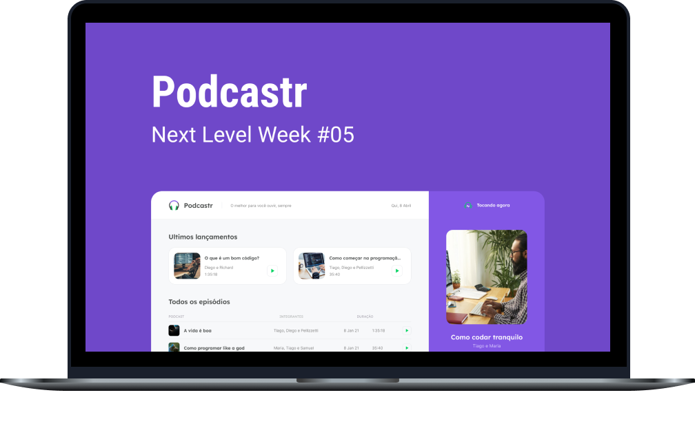

<h1 align="center">
  
</h1>

<p align="center">Podcasts com tecnologia. Pense diferente. Pense em áudio 🎧</p>

<h4 align="center">Versão 1.0</h4>

<p align="center">
  <a href="#-sobre">Sobre</a>&nbsp;&nbsp;&nbsp;|&nbsp;&nbsp;&nbsp;
  <a href="#-tecnologias">Tecnologias</a>&nbsp;&nbsp;&nbsp;|&nbsp;&nbsp;&nbsp;
  <a href="#-layout">Layout</a>&nbsp;&nbsp;&nbsp;|&nbsp;&nbsp;&nbsp;
  <a href="#-to-do">To-Do</a>&nbsp;&nbsp;&nbsp;|&nbsp;&nbsp;&nbsp;
  <a href="#information_source-instalação-e-uso">Instalação</a>&nbsp;&nbsp;&nbsp;|&nbsp;&nbsp;&nbsp;
  <a href="#-licença">Licença</a>
</p>

<p align="center">
  
  

  <a href="https://github.com/carlosmfreitas2409/nlw-05-podcastr/commits/master">
    
  </a>
  
</p>

<p align="center">
  
</p>

<p align="center">
  <a href="https://vercel.com/" target="_blank">
    
  </a>
</p>

----

## 💡 Sobre

O Podcastr é uma plataforma para transmissões de podcasts, te levando ainda mais perto dos melhores podcasts de tecnologia!

Este projeto foi desenvolvido durante a 5º edição da Next Level Week (NLW), um evento realizado pela [Rocketseat](https://rocketseat.com.br). 

## 🛠️ Tecnologias

Esse projeto foi desenvolvido usando as seguintes tecnologias:

- [Next.js](https://nextjs.org/)
- [ReactJS](https://pt-br.reactjs.org)
- [Typescript](https://typescriptlang.org/)
- [Axios](https://github.com/axios/axios)
- [SASS](https://sass-lang.com/)
- [Date-fns](https://date-fns.org/)
- [RC Slider](https://github.com/react-component/slider/)

## 🎨 Layout

Nos links abaixo você encontra o layout do projeto Web. Lembrando que você precisa ter uma conta no [Figma](https://figma.com) para acessá-lo.

- [Layout Web](https://www.figma.com/file/UwFEntsHpHYJlHNQAQr4gA/Podcastr)

## :information_source: Instalação e uso

Para clonar e executar esta aplicação, você precisará do [Git](https://git-scm.com/) e [Yarn](https://yarnpkg.com/). A partir de sua linha de comando:

```bash
# Clone este repositório
$ git clone https://github.com/carlosmfreitas2409/nlw-05-podcastr

# Entre no repositório
$ cd podcastr

# Instale as dependências
$ yarn

# Rode a aplicação
$ yarn dev

# Navegue para http://localhost:3000
# A aplicação será recarregada automaticamente se você alterar qualquer um dos arquivos. 
```

## ⚙️ Como contribuir

- Faça um fork desse repositório;
- Crie uma branch com a sua feature: `git checkout -b minha-feature`;
- Faça commit das suas alterações: `git commit -m 'feat: Minha nova feature'`;
- Faça push para a sua branch: `git push origin minha-feature`;

## 📝 Licença

Esse projeto está sob a licença MIT. Veja o arquivo [LICENSE](https://github.com/carlosmfreitas2409/nlw-05-podcastr/blob/master/LICENSE) para mais detalhes.

---

Feito com 💜 por Carlos Eduardo 👋 [Confira meu LinkedIn](https://www.linkedin.com/in/carlosmeduardo/)